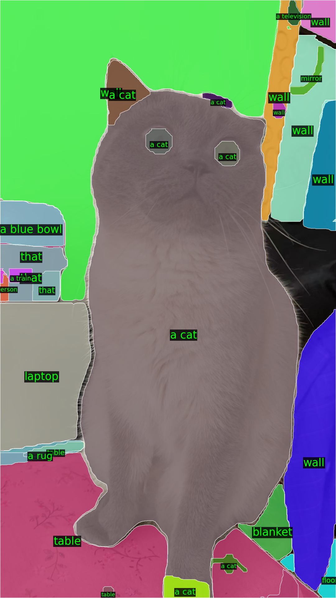

## Semantic-Fast-SAM
SSA + FastSAM \
I'm inspired by FastSAM that higly faster than sam but sustains sam's performance succesfully.\
(obviously, there are few Degraded performance, but still efficient i think)\
this Semantic-Fast-SAM is also inspired by Semantic-Segment-Anything(i.e.,SSA). but change main segmentation branch, SAM(vit-h) to FastSAM(YOLOv8-seg).

## Installation

To install the required dependencies, run the following command:

```bash
git clone https://github.com/KBH00/Semantic-Fast-SAM.git
```
```
cd Semantic-Fast-SAM
```
```
conda env create -f environment.yaml
```
```
conda activate sfs
```
```
python -m spacy download en_core_web_sm
```

You need to download Fast-SAM model checkpoint in [here][(https://drive.google.com/file/d/1l7l1VJmpD1nOsgiTXucTtYOpu3nE-rjh/view?usp=drive_link)]\
Put FastSAM.pt in weights directory, mabye you should change the file name FastSAM-x.pt to FastSAM.pt


## Inference
```
python scripts/main_ssa_engine.py --data_dir=data/<The name of your image> --out_dir=output --world_size=<choose GPU number>
```
Or, you can just run main_ssa_engine.py

## Examples



## References

Fast Segment Anything
https://github.com/CASIA-IVA-Lab/FastSAM

Semantic Segment Anything
https://github.com/fudan-zvg/Semantic-Segment-Anything

